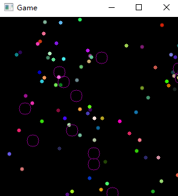

# CUHK 2021-2022 Term 1

# ELEG4701 LabSheet 2: Python programming

  

Name:

SID&ensp;&ensp;:

----

## Part 1 Prepared for programming

&ensp;&ensp;
In this part, you should **install the python environment**, read the jupyter notebooks and play with toy scripts.
   
 Checked by TA ________________.
  

-----

## Part 2 Process Oriented Programming 

&ensp;&ensp;
In this part, you should **modify the hw_process_ori_coding**, let the doraemon becomes the original version (The yellow one).

 

   
 Checked by TA ________________.
  

----

## Part 3 Object Oriented Programming

&ensp;&ensp;
In this part, you should **modify the hw_oop_coding**, and finish **all the TODOs**.
  0. Change the title
  1. Add another bullet class
  2. Add Collision to the wall

 

   
 Checked by TA ________________.
  