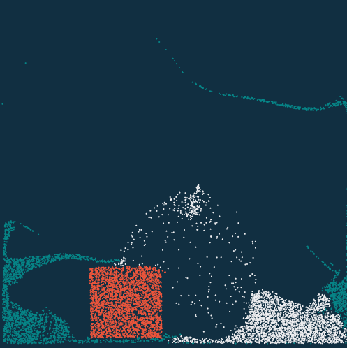
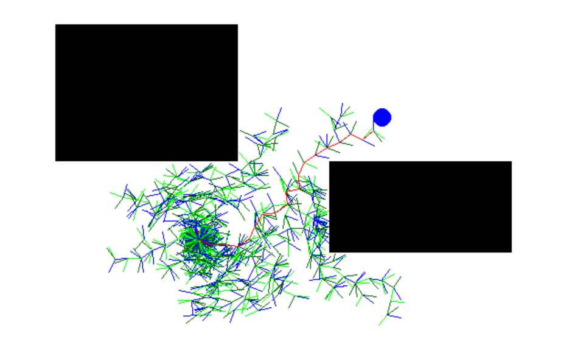

# Python Tutorial for ELEG4701
## Term 2021-2022 

TA:  Li Ang (psw.liang@link.cuhk.edu.hk)

-----
* This tutorial is consists of basic python guideline, python tutorial for robot stuffs, and Advanced programming skills


Recommended Reading:

[Docs of Python (English)](https://docs.python.org/3/tutorial/)

[Liao's Python Tutorial  (Example codes)](https://github.com/michaelliao/learn-python3/tree/master/samples)

-----

## Part 0. Guide line of self-evaluation

If you are familar with python, just jump to 
part 2
####  Environment and install
```python
# Basically, you have three way to get a python environment.

# 1.Using IDE, such as Pycharm(get community version via your CUHK e-mail address).
# 2.Using interpreter with an (powerful) text editor such as VS code.
# 3.Using Anaconda (Not Deprecated in our course for confilcts may caused when you using ROS in the Lab computer).

pip install numpy
# Install a code package via pip.
# In this case, you installed numpy for your environment.
# Similarily, you can use pip uninstall xxx to remove a package.
```
#### Q0. If you know the purpose of the following code, jump to part 2
```python
c = "#"+"".join([random.choice('0123456789ABCDEF') for x in range(6)])
print(c)
```

You should understand codes below

#### Q1. Variable, Type, and Equation
```python
a = 1
b = '1'
print(a == b, type(a), type(b), type(a == b))
# the result is"False, <class 'int'>, <class 'str'>, <class 'bool'>"
# if you have problem with this, please read note_1
```
#### Q2. Logic and Functions
```python
def fun1():
    print("the first funcntion")
    for i in range(3):
        print('iteration', i)
        if i == 1:
            print("print extra stuffs")
        if i == 3:
            print("it will never happens because range stops in 3")

def fun2(sth):
    print('the second funcion, input args is', sth)

def fun3(*args, **kargs):
    # you don't need to write all args
    # you can use *args and **kargs to hide them
    print(args)
    if 'kw' in kargs:
        print("has key arg kw:",kargs['kw'])
    else:
        print("other kw:", kargs)

def fun4():
    return 4

def fun5(functor):
    print(functor())

def fun():
    fun1()
    fun2('abcd')
    fun3(1, 2, 3, 4, 5, kw=6)
    #in this case, the input is a number, becase the fun4 is called before being a argument
    fun3(fun4())
    # in this case, the input is a function
    fun5(fun4)

fun() # call function here
# the result is following:
'''
the first funcntion
iteration 0
iteration 1
print extra stuffs
iteration 2
the second funcion, input args is abcd
(1, 2, 3, 4, 5)
has key arg kw: 6
(4,)
other kw: {}
4
'''
```

#### Q3. Inheritance and composition
```python

class BasicClass():
    def __init__():
        self.basic_sth = 0

class A(BasicClass):
    def __init__():
        self.a_sth = 1

class B(BasicClas):
    def __init__():
        self.b_sth = 2


a = A()
b = B()
print(a)
print(b)

```

## Part 1. Python Tutorial for Robot

## Part 2. Advanced programming skills

### A. Ways to acceleate calculation

### B. Using pyinstaller to package your program

### C. Using PySide2(pyqt) to make a user interface

### D. Try some interesting works

I collected some example script of following works, wish it can recall your interests.

* [Taichi, a programming language designed for high-performance computer graphics.](https://github.com/taichi-dev/taichi)

 

* [A visualization script of Rapdily-exploration Random Tree](https://github.com/howardjchen/RRT)

 

* [A script draws Doraemon](https://github.com/PerpetualSmile/Python-Painting-Doraemon)

 
---


## Thanks