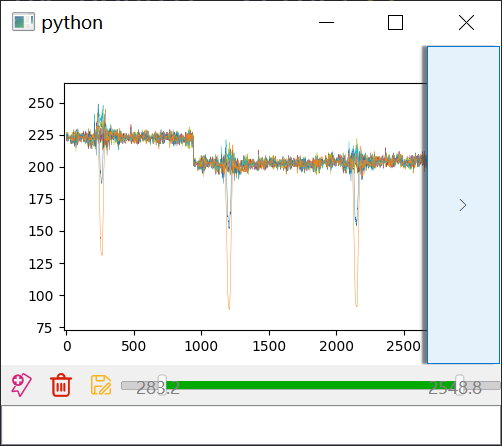

# Python Tutorial for ELEG4701
## Term 2021-2022 

TA:  Li Ang (psw.liang@link.cuhk.edu.hk)

-----
* This tutorial is consists of basic python guideline, introduction to basic programming paradigm, and Advanced programming skills


Recommended Reading:

[Docs of Python (English)](https://docs.python.org/3/tutorial/)

[Liao's Python Tutorial  (Example codes)](https://github.com/michaelliao/learn-python3/tree/master/samples)

-----

## Part 0. Guide line of self-evaluation

If you are familar with python, just jump to 
part 2
####  Environment and install
```python
# Basically, you have three way to get a python environment.

# 1.Using IDE, such as Pycharm(get community version via your CUHK e-mail address).
# 2.Using interpreter with an (powerful) text editor such as VS code.
# 3.Using Anaconda (Not Deprecated in our course for confilcts may caused when you using ROS in the Lab computer).

pip install numpy
# Install a code package via pip.
# In this case, you installed numpy for your environment.
# Similarily, you can use pip uninstall xxx to remove a package.
```
#### Q0. If you know the purpose of the following code, jump to part 2
```python
c = "#"+"".join([random.choice('0123456789ABCDEF') for x in range(6)])
print(c)
```

You should understand codes below

#### Q1. Variable, Type, and Equation
```python
a = 1
b = '1'
print(a == b, type(a), type(b), type(a == b))
# the result is"False, <class 'int'>, <class 'str'>, <class 'bool'>"
# if you have problem with this, please read note_1
```
#### Q2. Logic and Functions
```python
def fun1():
    print("the first funcntion")
    for i in range(3):
        print('iteration', i)
        if i == 1:
            print("print extra stuffs")
        if i == 3:
            print("it will never happens because range stops in 3")

def fun2(sth):
    print('the second funcion, input args is', sth)

def fun3(*args, **kargs):
    # you don't need to write all args
    # you can use *args and **kargs to hide them
    print(args)
    if 'kw' in kargs:
        print("has key arg kw:",kargs['kw'])
    else:
        print("other kw:", kargs)

def fun4():
    return 4

def fun5(functor):
    print(functor())

def fun():
    fun1()
    fun2('abcd')
    fun3(1, 2, 3, 4, 5, kw=6)
    #in this case, the input is a number, becase the fun4 is called before being a argument
    fun3(fun4())
    # in this case, the input is a function
    fun5(fun4)

fun() # call function here
# the result is following:
'''
the first funcntion
iteration 0
iteration 1
print extra stuffs
iteration 2
the second funcion, input args is abcd
(1, 2, 3, 4, 5)
has key arg kw: 6
(4,)
other kw: {}
4
'''
```

#### Q3. Inheritance and composition
```python
class BaseClass():
    def __init__(self):
        self.basic_sth = 0
    
    def print_self(self):
        print(type(self) ,'Functions will be inherited by default')
    
    def __lalala(self):
        print(type(self), 'it could not be inherited because you write __ in the functin name')
    
    @staticmethod
    def sfunc():
        print('this function do not needs self, because it belongs to Class, not object')
        print('call it by BasicClass.sfunc()')

class A(BaseClass):
    def __init__(self):
        super().__init__() # called __init__ of super class
        self.a_sth = 1

class B(BaseClass):
    def __init__(self):
        # if you do not write super().__init__() here, you can not use basic_sth from the baseclass
        self.b_sth = 2
    

c = BaseClass()
a = A()
b = B()

c.print_self()
a.print_self()
b.print_self()

BaseClass.sfunc()
# or you can use
a.sfunc()
b.sfunc()
c.sfunc()


print(c.basic_sth)
print(a.basic_sth, a.a_sth)
print( b.b_sth)

# try to imagine the output
# and run toy_script/try_q3.py

```

## Part 1. Basic Programming Paradigm
    As a python beginner, you only need to understand process-oriented and object-oriented. I will show how to work with different paradigms using the example of 'how to put elephants in the frige.'

```python
    # A. Process oriented programming

    def main():
        # the flow chart is always:
        # do [action] to [sth]
        open_frige() 
        let_in(elephant_data)
        close_frige()

```

```python
    # B. Object oriented programming

    class BaseFrige:
        def __init__():
            self.container = []
        def __open(self)
            pass
        def __close(self)
            pass
        def put(self, target):
            self.open()
            self.container.append(target)
            self.close()
    
    class Siemens(BaseFrige):
        pass
    class Midea(BaseFrige):
        pass

    class Animal:
        pass
    class Lion(Animal):
        pass
    class Elephant(Animal):
        pass

    def main():
        # in this case, 
        # The frige can hide thier open, and close fucntion
        # Besdies, you can made many different frige, and all of them can do the same things.
        e = Siemens() #or Midea()
        e.put(Elephant())

```    


## Part 2. Advanced programming skills (Briefly)

### A. Ways to acceleate calculation
  ** Numpy->Cupy<br><br>
  ** Numpy->dll<br><br>
  ** Numpy->Cuda<br><br>
  ** Numpy->pytorch-gpu<br><br>
  ** Cython

### B. Using pyinstaller to package your program
  ** pyinstaller -D -w --key [your key] [xxxx.py]

  ** pyinstxtractor

  ** Compile your python with cython
### C. Using PySide2(pyqt) to make a user interface
   

   This is an pyqt demo for 1-d signal annotation. The codes writing for user interfaces is usually object-oriented. Because this coding style can maintain an user interface easily.
   
   At the same time, because python has 'duck type', it is easier to write an interface than other languages like Cpp or Java. 
   Here is only a brief introduction. If you are interested in making UI, you can also read how to use languages designed for making UI like html, qml and other  designed (they can communicate with python easily).

### D. Try some interesting works

I collected some example script of following works, wish it can recall your interests.

* [Taichi, a programming language designed for high-performance computer graphics.](https://github.com/taichi-dev/taichi)

 

* [A visualization script of Rapdily-exploration Random Tree](https://github.com/howardjchen/RRT)

 

* [A script draws Doraemon](https://github.com/PerpetualSmile/Python-Painting-Doraemon)

 
---


## Thanks